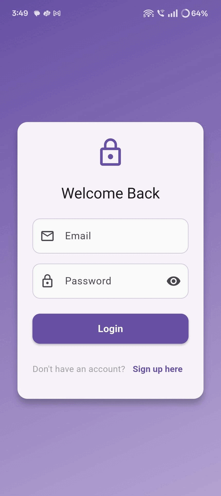
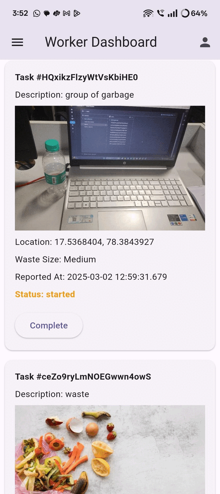
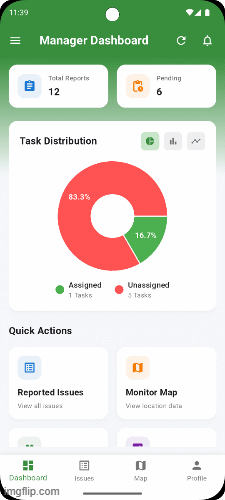

# ♻️ AI-Powered Waste Reporting Platform

## 🛑 Problem Statement
Urban areas face significant challenges in waste management due to:
- 🚧 **Inefficient monitoring systems**
- 🕒 **Delayed response times**
- 🙅‍♂️ **Lack of citizen engagement**

The absence of real-time reporting mechanisms and proper incentivization has resulted in:
- 🗑️ **Accumulation of roadside waste**
- ⚠️ **Public health hazards**
- 🌍 **Environmental degradation**

---

## 💡 Solution Approach
Our project addresses these issues through an AI-powered waste management platform with the following key features:

1. **🖼️ Waste Detection with AI**:
   - Utilizes TensorFlow for image processing to accurately identify waste from citizen-submitted photos.
   - Tracks waste location for precise monitoring and reporting.

2. **⚙️ Automated Municipal Response**:
   - Generates real-time alerts for waste detection.
   - Assigns cleanup tasks to municipal workers and monitors their progress via a centralized dashboard.

3. **🤝 Citizen Engagement**:
   - Enables citizens to report waste by submitting photos.
   - Rewards contributors with redeemable points, fostering ongoing community involvement.

4. **📊 Data Analytics Integration**:
   - Leverages analytics for resource optimization and operational efficiency.
   - Tracks waste patterns and trends to support data-driven decision-making.

5. **🌱 Sustainability Focus**:
   - Follows the **4R principles**: Reduce, Reuse, Recycle, and Recover.
   - Encourages sustainable waste management practices.

---

## 🎥 App Preview

| Citizen Features 👥 | Worker Features 👨‍🌾 | Manager Features 🦸‍♂️ |
|---------------------|---------------------|----------------------|
|  |  |  |

---

## 🛠️ Key Features
- **🤖 AI-Powered Waste Detection**: Accurate identification and classification of waste.
- **📍 Location-Based Tracking**: Monitors the location of reported waste for efficient cleanup.
- **📋 Centralized Dashboard**: Provides real-time updates and task management for municipal authorities.
- **🎁 Incentive System**: Citizens earn redeemable points for reporting waste.
- **♻️ Sustainability Integration**: Promotes environmentally friendly practices through analytics and the **4R approach**.

---

## 🧑‍💻 Technologies Used
- **TensorFlow**: For AI-based waste detection and image processing.
- **🖥️ Centralized Dashboard**: To facilitate task assignment and progress tracking.
- **📡 Location Tracking**: For pinpointing waste locations.
- **📈 Data Analytics**: For optimizing resources and improving response times.

---

## 🔄 How It Works
1. **📸 Citizen Reporting**:
   - Citizens capture photos of waste and upload them via the platform.
   - The AI model processes the images to identify the type and severity of waste.

2. **🚨 Alert Generation**:
   - The system sends real-time alerts to the municipal dashboard.
   - Cleanup tasks are assigned automatically based on location and priority.

3. **📊 Cleanup Monitoring**:
   - Progress is tracked through the dashboard until the issue is resolved.
   - Citizens receive points once their reports are verified and addressed.

4. **🌍 Sustainability Analytics**:
   - Data on waste patterns is collected to improve future waste management strategies.
   - Insights are used to drive sustainable practices.

---

## 🌟 Benefits
- **⚡ Efficient Waste Management**: Faster and more accurate waste detection and response.
- **🙌 Enhanced Citizen Participation**: Incentivizes community members to report waste actively.
- **🛡️ Public Health Improvement**: Reduces roadside waste accumulation and related hazards.
- **🌱 Environmental Sustainability**: Encourages recycling and resource recovery through the **4R principles**.

---

## 🔮 Future Scope
- 🤖 Expand AI capabilities to detect specific waste types (e.g., recyclable vs. non-recyclable).
- 🌐 Integrate IoT sensors for automated waste level monitoring in bins.
- 🗣️ Develop multi-language support for broader accessibility.
- 🌆 Scale the platform for use in multiple urban areas.

---

## 🤝 Contributing
Contributions are welcome! Feel free to open an issue or submit a pull request to improve the platform.

---

## 📜 License
This project is licensed under the MIT License. See the [LICENSE](./LICENSE) file for details.

  Made with ❤️ by Akhil & Rohith

